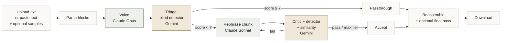

# AI Text Rephraser

> Turn AI-generated text into prose that reads like a human actually wrote it.

[](LICENSE)
[](https://www.python.org/downloads/)
[](https://github.com/mihakim2/ai-text-rephrase/pulls)

A local Flask app that takes AI-written text and rewrites it to sound like a PhD student's own writing. Cross-family LLM judging (Claude writes, Gemini judges), document structure preservation, optional voice cloning from your own samples, and a blind AI detector that gates every accepted rewrite.

## Why

Every AI-rephrasing tool I tried had three problems:

1. It rewrote sentence-by-sentence and broke the paragraph rhythm.
2. It used a single LLM as both writer and judge, so it Goodharted against its own rubric.
3. It used a fixed "academic voice" instead of matching the author's actual style.

This project fixes all three.

## Features

- **Two modes.** Deep (paragraph-level, structure-preserving) and Quick (sentence-level, faster).
- **Cross-family judging.** Claude rewrites; Gemini judges. Different training data, different blind spots.
- **Blind AI detector.** A separate Gemini call with no rubric is the real acceptance gate. The prompted critic is what teaches the rewriter how to fix flagged issues.
- **Similarity gate.** The critic sees both the original and the rewrite, so near-copies are rejected even if they sound human.
- **Structure preservation.** Headers, lists, code blocks, and math are never touched.
- **Triage.** Paragraphs that already sound human are preserved verbatim (no API calls wasted, no good writing overwritten).
- **Voice cloning.** Paste 2-3 paragraphs of your own writing and the rewriter matches that voice directly.
- **Iterative refinement.** Up to three rewrite attempts per chunk, each one fed concrete feedback from the critic.
- **Live progress.** Server-Sent Events stream per-block status, scores, and the same logs you see in the terminal.
- **Inline diff view.** See exactly what changed at the word level when a run finishes.
- **Token usage summary.** Every run reports per-model token counts; saved to `usage.json`.
- **Checkpoints.** Crash mid-run? `runs/<date>/<time>/checkpoint.txt` has the latest recoverable draft.
- **No em-dashes.** Banned in the prompt and stripped by a post-processor. Em-dashes are one of the strongest "this was written by AI" tells.

## Demo

(Add screenshots / GIF here.)

## Quick start

```bash
git clone git@github.com:mihakim2/ai-text-rephrase.git
cd ai-text-rephrase
python3 -m venv .venv
source .venv/bin/activate
pip install -r requirements.txt
cp .env.example .env
```

Edit `.env` and add your API keys:

```
ANTHROPIC_API_KEY=sk-ant-...
GEMINI_API_KEY=...
```

Where to get keys:
- Anthropic: https://console.anthropic.com/settings/keys
- Gemini: https://aistudio.google.com/apikey

Run:

```bash
python app.py
```

Open http://127.0.0.1:5055 in your browser. The app also listens on your LAN and Tailscale IPs by default (set `HOST=127.0.0.1` to restrict to local only).

## How it works (Deep mode)



**Design choices worth knowing:**

- **Blind detector is the honesty signal.** The prompted critic learns to flag the AI tells you put in its rubric, and the rewriter learns to dodge those exact tells. That is Goodhart's law in motion. The blind detector has no rubric. Its score is much harder to game.
- **Voice cloning beats inferred voice.** Auto-extracted "voice profiles" capture surface features (sentence length, hedge frequency). A few real paragraphs of the author's own writing capture rhetorical moves, characteristic transitions, and idiom. Use the samples textarea in Deep mode.
- **Triage skips good writing.** If the blind detector scores the original at 7 or higher, the paragraph is preserved verbatim. No rewrite request is sent. This saves tokens and prevents the rewriter from washing out paragraphs that were already fine.

## Quick mode (the simpler pipeline)

Quick mode does sentence-by-sentence rewriting with a single critic loop. Faster, simpler, less stylistically cohesive. Best for short documents or when you do not need structure preservation.


## Usage

1. Open the app, click "How it works" in the header for a quick overview.
2. Pick **Deep** or **Quick** mode.
3. Either upload a `.txt` file or paste text directly into the textarea.
4. (Deep only) Paste a few paragraphs of your own writing in the samples textarea if you want voice cloning.
5. Click **Start rephrasing**. Watch live progress and the streaming terminal log.
6. When the run completes, click **View changes** for a word-level diff, then **Download final .txt**.

Every run also saves a complete audit trail to `runs/<date>/<time>/`:

```
runs/2026-05-14/13-45-22/
  input.txt              source text
  voice_profile.json     inferred voice (or extracted from your samples)
  log.txt                full plain-text log
  checkpoint.txt         latest concatenated draft, overwritten as the run progresses
  doc.json               per-block state with all rephrase versions and scores
  usage.json             per-model token usage
  output.txt             final reassembled document
```

## Configuration

All knobs live in `config.py`. The defaults are tuned for a careful, conservative pipeline.

| Group | Setting | Default | Notes |
|---|---|---|---|
| Mode | `DEFAULT_MODE` | `"deep"` | mode used when the request does not specify one |
| Models | `MODEL_INTENT` | `claude-haiku-4-5` | fast intent extraction |
| | `MODEL_REPHRASER` | `claude-sonnet-4-6` | the main rewriter |
| | `MODEL_VOICE_PROFILE` | `claude-opus-4-7` | voice calibration |
| | `MODEL_FINAL_PASS` | `claude-sonnet-4-6` | document-level coherence pass |
| | `MODEL_CRITIC` | `gemini-2.5-pro` | prompted critic with rubric |
| | `MODEL_DETECTOR` | `gemini-2.5-pro` | unprompted blind detector |
| | `CRITIC_PROVIDER` | `"gemini"` | set to `"anthropic"` to use Claude as critic |
| | `DETECTOR_PROVIDER` | `"gemini"` | set to `"anthropic"` to use Claude as detector |
| Deep | `DEEP_CHUNK_BATCH_SIZE` | `3` | paragraphs per critic call |
| | `DEEP_PASSTHROUGH_SCORE` | `7` | originals scoring at or above this skip rewriting |
| | `DEEP_TARGET_DETECTOR_SCORE` | `7` | blind detector threshold to accept a rewrite |
| | `DEEP_TARGET_CRITIC_SCORE` | `7` | prompted critic threshold to accept a rewrite |
| | `DEEP_MAX_SIMILARITY_SCORE` | `5` | reject rewrites that are too close to the original |
| | `DEEP_MAX_ITERATIONS` | `3` | rewrite attempts per paragraph |
| | `CHECKPOINT_EVERY_BLOCKS` | `5` | save checkpoint every N processed blocks |
| Quick | `BATCH_SIZE` | `5` | sentences per critic pass |
| | `MAX_ITERATIONS` | `3` | rewrite attempts before accepting best so far |
| | `TARGET_AI_SCORE` | `8` | critic threshold to pass (0-10, 10 = human) |
| | `TARGET_FLOW_SCORE` | `7` | inter-sentence flow threshold |
| | `CONTEXT_BEFORE` / `_AFTER` | `3` / `3` | sentences of context fed to the rewriter |
| | `CHECKPOINT_EVERY` | `20` | save checkpoint every N sentences |
| Runtime | `PARALLEL_WORKERS` | `8` | concurrent intent + rephrase workers |

## Architecture

```
ai-text-rephrase/
├── app.py               Flask: upload (file or paste), start, SSE stream, download
├── rephraser.py         Dispatcher: routes a job to quick_mode or deep_mode
├── quick_mode.py        Sentence-level pipeline
├── deep_mode.py         Block-level pipeline with triage + blind detector + samples
├── structure.py         Block parser and reassembly (prose, header, list, code, math)
├── llm_client.py        Anthropic + Gemini wrappers, prompts, JSON parsing, dash scrubber
├── config.py            All models, thresholds, batch sizes, checkpoint cadence
├── job_store.py         Thread-safe in-memory job store + SSE event queue
├── logging_config.py    Color console logger + per-job file/SSE logger
├── run_dir.py           Creates runs/YYYY-MM-DD/HH-MM-SS/
├── usage.py             Per-job per-model token tracker
├── templates/index.html Single-page UI: mode selector, samples textarea, file upload, paste
├── static/app.js        Upload, EventSource progress, live log, inline diff, modal
├── static/styles.css    Calm light theme
├── requirements.txt
└── runs/                Per-job artifacts (gitignored)
```

Tech stack:
- Python 3.11+, Flask 3, vanilla HTML/JS (no build step)
- Anthropic SDK (`anthropic`), Google GenAI SDK (`google-genai`)
- `pysbd` for sentence segmentation (pure Python, no native deps)
- Server-Sent Events for live progress and log streaming
- One background thread per job, in-memory job store (single-user local app)

## Limitations and honest caveats

- **It is not a magic AI detector evader.** The blind detector here is one LLM judging another; real AI detectors (GPTZero, Originality.ai, Pangram) may still flag the output. The system optimizes against an internal honesty signal, not those external services.
- **Cost is non-trivial.** A typical 1500-word document runs roughly 30-50 API calls across four models. The summary at the end of every run shows exact token counts. Token usage is visible per-model in the UI when a run finishes.
- **No multi-user support.** In-memory job store, one background thread per job, no auth. Designed for single-user local use over Tailscale or LAN.
- **English only (for now).** `pysbd` segmenter is configured for English; prompts assume English source text.

## API and external services

This app sends your text to Anthropic and Google APIs to do the actual rewriting. If your content is sensitive, review their data-retention policies before using.

## Contributing

PRs and issues welcome. A few ideas in the parking lot:

- Plug in a real AI detector (GPTZero, Originality.ai) as an additional acceptance signal.
- Adversarial loop: feed final output to a fresh detector, iterate the whole document.
- Persist history across server restarts (currently in-memory only).
- Add diff export (per-block changes as a `.diff` or annotated `.html`).
- Localize for other languages.

## License

MIT. See [LICENSE](LICENSE).
