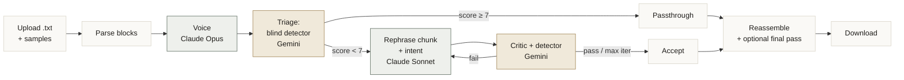

# Rephraser

Turn AI-written text into prose that reads like the author's own honest writing.

Upload a `.txt`, pick **Quick** or **Deep** mode, optionally paste a few paragraphs of your own writing, and download a polished `.txt` plus a full audit trail.

---

## Two modes

| | **Quick mode** | **Deep mode** *(default, recommended)* |
|---|---|---|
| **Unit of work** | one sentence | one paragraph (with structure preserved) |
| **Triage** | none — rewrites everything | blind AI detector skips paragraphs already human enough |
| **Voice signal** | inferred from doc samples | from your writing samples (if provided) or doc samples |
| **Acceptance gate** | single critic score | dual gate: prompted critic **AND** blind detector both must pass |
| **Structure** | flattened into sentences | headers / lists / code / math preserved verbatim |
| **Best for** | short docs, when speed > polish | every other case |

---

## How Deep mode works



The compact view hides three details worth knowing:

- **Voice source**: if the user pasted samples, voice comes from those; otherwise from sampled document paragraphs.
- **Acceptance gate**: a rewrite passes only when **both** the prompted critic AND the blind detector clear their thresholds. The blind detector (no rubric) is the honesty signal.
- **Final pass**: only runs if at least one block needed iteration. Skipped otherwise.

### Why these design choices

- **Blind detector (Gemini, NO rubric) is the real gate.** The prompted critic learns to flag the AI tells we listed — and the rewriter learns to dodge those exact tells. That's Goodhart's law in motion. The blind detector has no rubric, no list of tells, just "was this written by AI? 0-10." Its score is a much harder thing to game.
- **Cross-family judging.** Writer is Claude (consistent voice). Critic and detector are Gemini. Different training data, different blind spots — Gemini catches what Claude wouldn't self-detect.
- **Triage before rewriting.** Most AI text has a few dozen smell-bomb paragraphs scattered through it; the rest is fine. We score the original first and skip what's already human enough. Saves work *and* preserves good writing.
- **Paragraph-level rewriting beats sentence-level.** AI-ness is a paragraph-level property (uniform rhythm, neat parallelism, predictable flow). Rewriting one sentence at a time can't fix that.
- **User samples > inferred voice.** A few real paragraphs the user actually wrote give the rewriter a far stronger voice signal than any auto-extracted profile.
- **Structure preservation.** Headers, lists, code blocks, math — never touched. The parser carves them out before any rewriting starts.

---

## How Quick mode works


---

## Project structure

```
document_rephrase/
├── app.py               Flask: upload (mode + samples), start, SSE stream, download
├── rephraser.py         Dispatcher — routes a job to quick_mode or deep_mode
├── quick_mode.py        Sentence-level pipeline
├── deep_mode.py         Block-level pipeline with triage + blind detector + samples
├── structure.py         Document block parser & reassembly (prose / header / list / code / math)
├── llm_client.py        Anthropic + Gemini SDK wrappers; all prompts; JSON parsing
├── config.py            All models, thresholds, batch sizes, checkpoint cadence, mode default
├── job_store.py         Thread-safe in-memory job store + SSE event queue
├── logging_config.py    Color console logger + per-job file/SSE logger
├── run_dir.py           Creates runs/YYYY-MM-DD/HH-MM-SS/
├── templates/index.html Single-page UI with mode selector + samples textarea
├── static/app.js        Upload, EventSource progress, live log, download
├── static/styles.css    Calm light theme
├── requirements.txt
└── runs/                Per-job artifacts (gitignored)
```

---

## Setup

```bash
python3 -m venv .venv
.venv/bin/pip install -r requirements.txt
cp .env.example .env
# Edit .env:
#   ANTHROPIC_API_KEY=sk-ant-...
#   GEMINI_API_KEY=...           # from https://aistudio.google.com/apikey
```

## Run

```bash
.venv/bin/python app.py
# Serves http://127.0.0.1:5055
# Override port: PORT=8123 .venv/bin/python app.py
```

Open the URL, pick a mode, optionally paste samples (Deep mode), drop a `.txt`, click **Start**. The page shows:

- Mode-aware progress (blocks with detector scores in Deep, sentences in Quick)
- Live log panel tailing the same lines the terminal prints
- A **Download .txt** button when the run completes

---

## Run artifacts

Every job writes to a fresh folder:

```
runs/
  2026-05-14/
    13-45-22/
      input.txt              source
      voice_profile.json     voice (with `source: user_samples` if you provided them)
      log.txt                full plain-text log
      checkpoint.txt         latest concatenated draft, overwritten as the run progresses
      doc.json               full per-block/per-sentence state with all versions + scores
      output.txt             final reassembled document
```

If a run dies mid-way, `checkpoint.txt` is the latest recoverable draft. We force-checkpoint before the final pass and on any uncaught error.

---

## Configuration

All knobs in `config.py`:

| Group | Setting | Default | Meaning |
|---|---|---|---|
| Mode | `DEFAULT_MODE` | `"deep"` | mode used when the request doesn't specify one |
| Models | `MODEL_INTENT` | `claude-haiku-4-5` | fast intent extraction |
| | `MODEL_REPHRASER` | `claude-sonnet-4-6` | main rewriter |
| | `MODEL_VOICE_PROFILE` | `claude-opus-4-7` | voice calibration |
| | `MODEL_FINAL_PASS` | `claude-sonnet-4-6` | document-level coherence |
| | `MODEL_CRITIC` | `gemini-3.1-pro-preview` | prompted critic with rubric |
| | `CRITIC_PROVIDER` | `"gemini"` | flip to `"anthropic"` to use Claude as critic |
| | `MODEL_DETECTOR` | `gemini-3.1-pro-preview` | unprompted blind detector |
| | `DETECTOR_PROVIDER` | `"gemini"` | flip to `"anthropic"` for Claude detector |
| Quick | `CONTEXT_BEFORE` / `CONTEXT_AFTER` | `3` / `3` | sentences of context fed to rewriter |
| | `BATCH_SIZE` | `5` | sentences per critic pass |
| | `MAX_ITERATIONS` | `3` | rewrite attempts before accepting best-so-far |
| | `TARGET_AI_SCORE` | `8` | critic threshold to pass (0-10, 10 = human) |
| | `TARGET_FLOW_SCORE` | `7` | inter-sentence flow threshold |
| | `CHECKPOINT_EVERY` | `20` | save checkpoint every N sentences |
| Deep | `DEEP_CHUNK_BATCH_SIZE` | `3` | paragraphs per critic call |
| | `DEEP_PARAGRAPH_CONTEXT_BEFORE` / `_AFTER` | `1` / `1` | paragraph context window |
| | `DEEP_PASSTHROUGH_SCORE` | `7` | if detector scores original at this or above, skip rewriting |
| | `DEEP_TARGET_DETECTOR_SCORE` | `7` | blind detector threshold to accept rewrite |
| | `DEEP_TARGET_CRITIC_SCORE` | `7` | prompted critic threshold to accept rewrite |
| | `DEEP_MAX_ITERATIONS` | `3` | rewrite attempts per paragraph |
| | `DEEP_SKIP_FINAL_PASS_IF_ALL_FIRST_TRY` | `True` | skip doc-level pass when nothing needed iteration |
| | `CHECKPOINT_EVERY_BLOCKS` | `5` | save checkpoint every N blocks (deep) |
| Parallelism | `PARALLEL_WORKERS` | `8` | concurrent intent + rephrase workers |

---

## Models

| Stage | Model | Why this one |
|---|---|---|
| Voice calibration | Claude Opus 4.7 | extracts a voice the writer will use coherently |
| Intent extraction | Claude Haiku 4.5 | cheap, fast, embarrassingly parallel comprehension |
| Rephraser | Claude Sonnet 4.6 | stylistic range without Opus's "correctness" instinct (which hurts here — we want imperfect human voice) |
| Prompted critic | Gemini 2.5 Pro | cross-family judge with a rubric → catches the tells we explicitly listed |
| Blind detector | Gemini 2.5 Pro | same family as critic but a fresh call with NO rubric → honest acceptance signal (Goodhart-resistant) |
| Final coherence pass | Claude Sonnet 4.6 | pronoun antecedents, dangling transitions, paragraph-level voice consistency |

---

## What gets skipped

**Quick mode** — trivial sentences pass through:
- Fewer than 8 words
- No sentence-ending punctuation (headers, list fragments, labels)

**Deep mode** — never touched at all:
- Headers (`# ...` or short bare-line titles)
- Lists (bulleted or numbered)
- Code blocks (triple backtick)
- Display math (`$$ ... $$`)
- Blank-line paragraph separators

Plus, **prose blocks that the blind detector already scores ≥ 7** on the original — preserved verbatim. The system trusts that what's already human-sounding doesn't need help.

---

## Tech stack

- Python 3.11+, Flask 3, vanilla HTML/JS (no build step)
- Anthropic SDK (`anthropic`), Google GenAI SDK (`google-genai`)
- `pysbd` for sentence segmentation (pure Python, ARM-native)
- Server-Sent Events for live progress + log streaming
- One background thread per job, in-memory job store (single-user local app)
